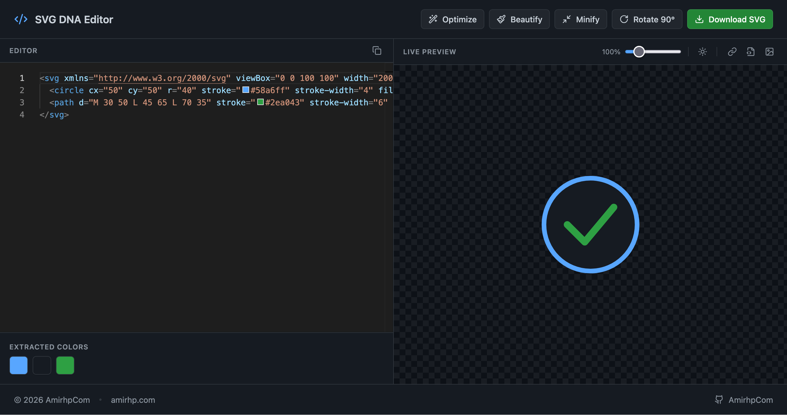

# SVG DNA Editor 🧬

A powerful, responsive, and beautifully styled SVG/HTML editor built with React and Tailwind CSS. Featuring a GitHub DNA-inspired dark theme, this tool is designed to make viewing, editing, optimizing, and exporting SVGs a breeze.

 <!-- Replace with actual screenshot -->

## ✨ Features

- **Advanced Code Editor**: Powered by Monaco Editor (the core of VS Code) with syntax highlighting, line numbers, and smooth typing.
- **Live Preview**: Instantly see your SVG render as you type.
- **Background & Zoom Controls**:
  - Toggle between dark and light checkerboard grid backgrounds (0.3 opacity) to perfectly view transparent SVGs.
  - Zoom slider to scale the preview from 10% up to 500%.
- **SVG Optimization & Security**: Clean up your SVGs by removing unnecessary comments, empty nodes, inline scripts, and event handlers, while ensuring the `xmlns` attribute is present.
- **Beautify & Minify**: Format your code for readability or minify it to save space.
- **Rotate**: Easily rotate your SVG 90° clockwise with a single click.
- **Color Extraction**: Automatically extracts all Hex and RGB colors from your SVG code into a clickable grid. Click any color to copy its hex code to your clipboard.
- **Multiple Export Options**:
  - Download as a `.svg` file.
  - Copy as **Data URI** (`data:image/svg+xml;utf8,...`).
  - Copy as **Base64** encoded string.
  - Copy as a ready-to-use **CSS Background Class**.
- **Responsive Design**: Side-by-side layout on tablets and desktops, and a stacked layout on mobile devices for optimal editing on the go.

## 🛠️ Tech Stack

- **React 19**
- **Tailwind CSS v4**
- **Monaco Editor** (`@monaco-editor/react`)
- **js-beautify** (for code formatting)
- **Lucide React** (for beautiful icons)

## 🚀 Getting Started

### Prerequisites

Make sure you have [Node.js](https://nodejs.org/) installed on your machine.

### Installation

1. Clone the repository:
   ```bash
   git clone https://github.com/amirhp-com/svg-dna-editor.git
   cd svg-dna-editor
   ```

2. Install the dependencies:
   ```bash
   npm install
   ```

3. Start the development server:
   ```bash
   npm run dev
   ```

4. Open your browser and navigate to `http://localhost:3000`.

## 👨‍💻 Author

**AmirhpCom (Amirhossein Hosseinpour)**
- Website: [amirhp.com](https://amirhp.com/landing)
- GitHub: [@amirhp-com](https://github.com/amirhp-com)

## 📄 License

This project is licensed under the MIT License.
